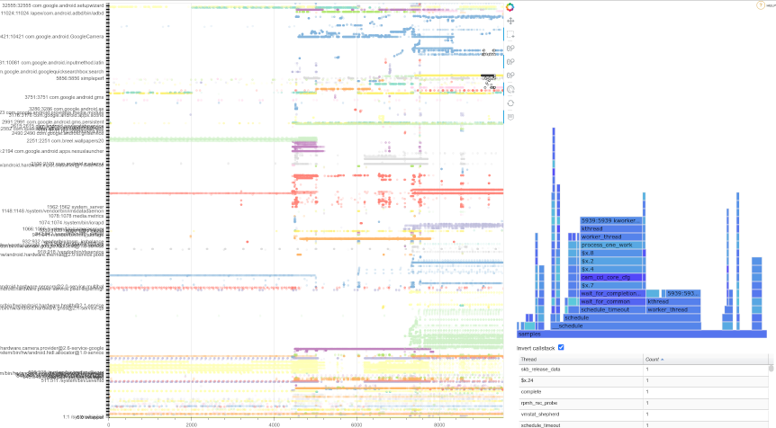
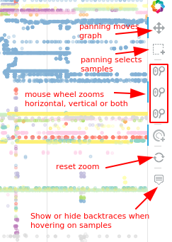
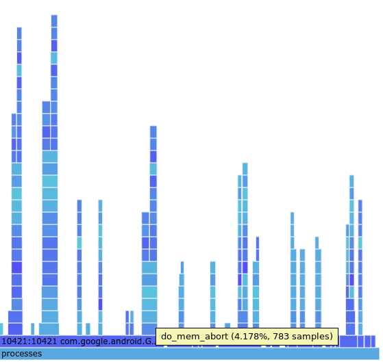
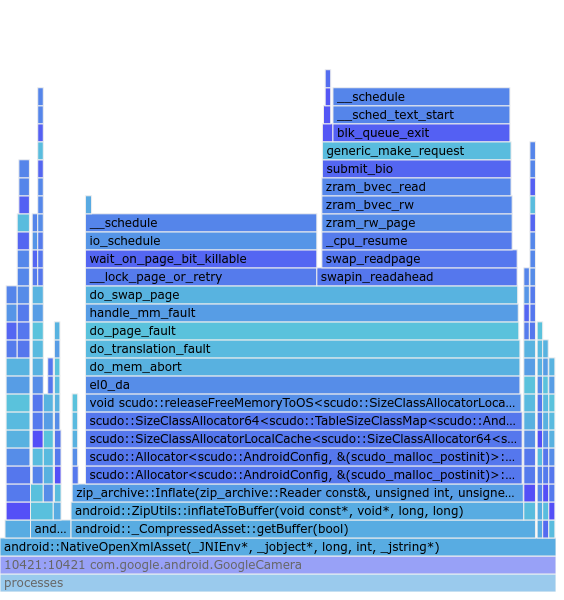
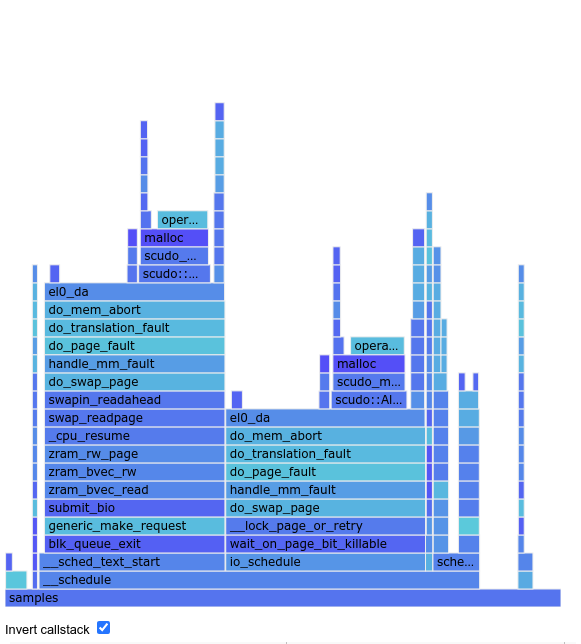
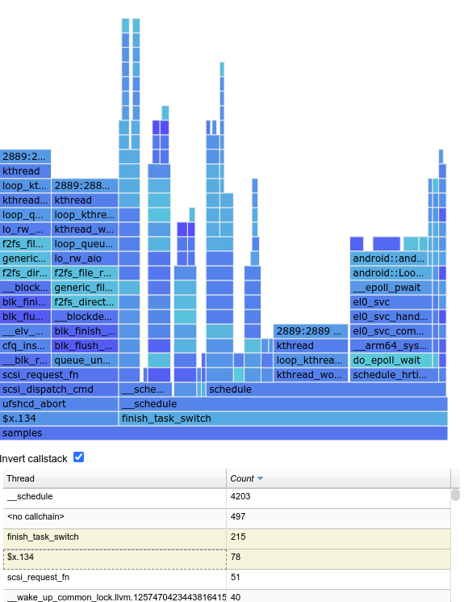

# Purgatorio

[link on wikipedia](https://en.wikipedia.org/wiki/Purgatorio)

Purgatorio is a visualization tool for simpleperf traces. It's based on [libsimpleperf](https://source.corp.google.com/android/system/extras/simpleperf/;l=1?q=simpleperf&sq=package:%5Eandroid$),
[Bokeh](https://bokeh.org/) and [D3 flamegraphs](https://github.com/spiermar/d3-flame-graph).

The main difference from [Inferno](https://source.corp.google.com/android/system/extras/simpleperf/scripts/inferno/;l=1) is that Purgatorio focuses on visualizing system-wide traces (the ones with the `-a` argument) on a time-organized sequence, and allow the user to interact with the graph by zooming, hovering on samples and visualize a flame graph for specific samples (be it restricted by time interval, set of threads or whatever subset).

## Obtaining the sources

    git clone sso://user/balejs/purgatorio

## Getting ready

**NOTE**: In theory it should work on most OSes, but Purgatorio has been tested on gLinux only. Any feedback, recommendations and patches to get it work elsewhere will be welcome (balejs@).

Purgatorio tends to be self-contained, but Bokeh and some of its dependencies aren't shipped with the default python libraries, hence they require to be installed with pip3. Assuming they already have python3 installed, Purgatorio hopefuls should follow these steps:

    $ sudo apt-get install python3-pip
    $ pip3 install jinja2 bokeh pandas

Run `python3 purgatorio.py -h` for a list of command-line arguments.

## Example

One can trace a Camera warm launch with:

    $ adb shell simpleperf record --trace-offcpu --call-graph fp -o /data/local/camera_warm_launch.data -a
    [launch camera here, then press ctrl + c]
    $ adb pull /data/local/camera_warm_launch.data

And then run:

    python3 purgatorio.py camera_warm_launch.data

If you get lots of "Failed to read symbols" messages, and backtraces in the diagram don't show the symbols you're interested into, you might want to try [building a symbols cache](https://chromium.googlesource.com/android_ndk/+/refs/heads/master/simpleperf/doc/README.md#how-to-solve-missing-symbols-in-report) for the trace, then run purgatorio again with:

    python3 purgatorio.py camera_warm_launch.data -u [symbols cache]

# Purgatorio interface
The Purgatorio User Interface is divided in three areas:

## Main Graph
It's the area to the left, including process names and color-coded dots grouped by process. It's used to navigate throungh the trace and identify samples of ineterest. By hovering on a sample (or set of samples) their callstacks will be visualized over the graph. When selecting a et of samples, their aggregated data will be visualized in the other sections of the UI. Multiple sections of the graph can be aggregated by holding down the [ctrl] button during selection.

The toolbox to the right can be used to configure interactions with the graph:

## Flame graph
The flame graph is located in the upper right portion. Once samples are selected in the main graph, the flame graph will show an interactive visualization for their aggregated callstacks. In this case the selection included mostly samples for com.google.android.GoogleCamera

It's possible to select a given stack entry to zoom on it and look at entry deeper in the callstack

When studiyng system issues it's often useful to visualize an inverted callstack. This can be done by clicking the related check box. The graph below is the same as in the first flame graph above, but with call stack inverted. In this case, inverted visualization directly points at [possible issues with io](http://b/158783580#comment12)

## Sample table
It's located in the lower right and counts samples by thread (for direct flame graphs) or symbol (for inverted flame graphs). Table columns can be sorted by clicking on their respective layers, and selecting specific lines filters the contents of the flame graph to the selected threads or symbols. Multiple lines can be selected at the same time.

